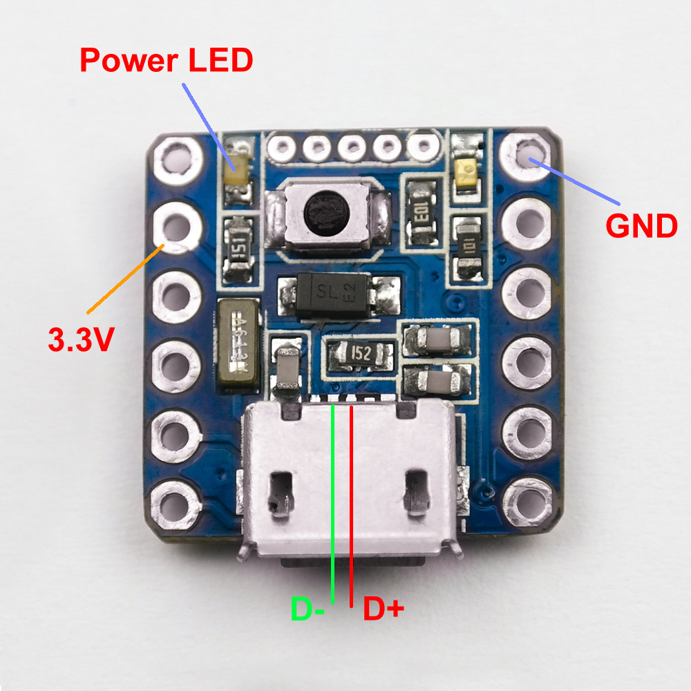

# Teardown

I am not going to detail the full teardown of the Nintendo Switch as you can
find videos and pictures online, but the gist of it goes like this:

* Remove the 4 triwing screws on the back panel
* Remove the screw at the top next to the fan output
* Remove the two screws next to the USB port (These screws are DIFFERENT than
  the previous one, keep them seperate)
* Remove the screw just below the SD card slot
* Remove the middle screw on both joycon rails

The back panel should now come off.

* Remove the screw holding in the MicroSD board
* Carefully remove the MicroSD board
* Remove all the screws holding the metal shield in place

The metal shield should come off easily.

**Unplug the battery from the switch.**

# Modifying the Exen Mini

## Removing the microusb port

You should probably remove the microusb port from the Exen Mini. I used a hot air
gun to achieve this. Be careful, because there are a few bits that go into the
board that might make it more difficult to remove.

## Muting the power LED light

Remove the power LED. This is to the left of reset button (usb port down), next to the 5V/3V pins. This is a waste of power if you
leave this on.

## Remove reset switch (Optional, reduce height)

If you want to be able to put the metal shield back on the switch, you will
need to remove the reset switch. If you keep the metal shield off you can
actually press the reset switch through the rear plastic case. This is only
useful to get into bootloader mode. This should not be needed now that Hekate
supports chainloading.

# Installing the Exen Mini

## Affix and solder Exen Mini

Now it is time to install the Exen Mini. Make sure the battery is **unplugged**
from the Switch.

Refer to the following picture for recommended placement of the Exen Mini.

Insulate and affix the Exen Mini to the metal shield or cut the metal shield with regular scissors. 
I used some Kapton tape to insulate and put a couple dabs of hot glue in the corners. xboxexpert used some
double sided tape to affix his mod.

Carefully wire up the Exen Mini as shown in the picture using some thin wire. Be
very careful with the point on the capacitor, and be very careful not to bridge
it with the adjacent capacitor.

# Test the mod

Feel free to connect the battery and test the mod. Use your joycon or jig to enable RCM. 
The Exen Mini should wake itself up and inject the payload.

The Exen Mini will blink once when it powers on. It will blink twice after that if no RCM device is detected (failure).

AutoRCM users will boot directly with no user intervention. Press Vol- to jump to the Hekate menu.

See Status Lights and Troubleshooting sections below if you are having issues.

# Reset wire?

You might want to consider running a wire from the "Reset" pin out the
kickstand opening. Touching this wire to the metal shield (which you can do
from the outside) will let you put the Exen Mini in bootloader mode and you can
reflash it. Other options are an internal magnetic reed switch, or a physical
switch installed somewhere.

The rear panel of the Switch is quite flexible, making a reset switch pushable
just by pushing the back. Use your imagination.

You can also drill a hole in the back case at the exact point where the reset button sits.

Hekate 4.0 (included) now supporting chainloading and autoboot, so updating the device via bootloader mode
should no longer be required.

# Reassemble switch

Make sure you insulate the top of the Exen Mini if you are installing the metal
shield.

Put it back together and hope you don't have any screws left over.

# Status Lights

This is the order of what happens when you turn the switch on:

1. Switch turned on
2. Exen Mini woken up, LED blinks once. The switch should boot into your payload.
3. RCM not found? Blinks twice after the initial "poweron" blink.
4. Exen Mini goes to sleep and waits for the Switch to turn on again

# Troubleshooting

* Exen Mini never injects payload

  Did you mix up D+ and D-?

* Exen Mini doesn't turn on

  It should turn on when you plug the Switch battery back in. Check `Bat` and
`Gnd`

* Exen Mini doesn't do anything when Switch is turned on

  Check that PWR connected to the cap without shorting anything