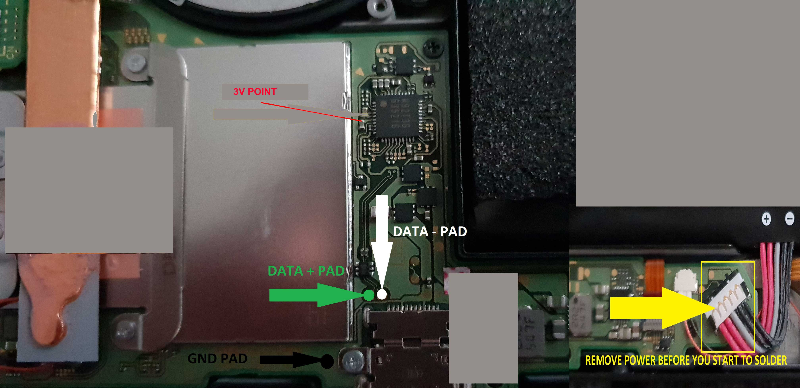
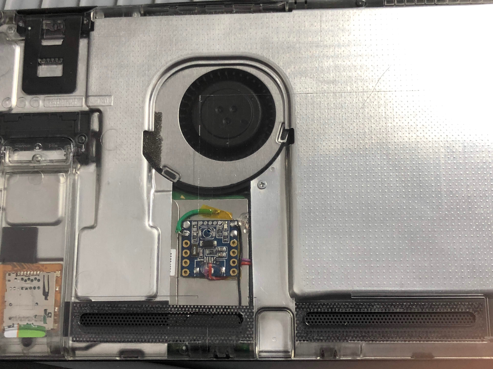

# sam-fusee-launcher-internal

This is an implementation of the Fusée Gelée launcher for the very tiny [Nerdonic Exen Mini](https://nerdonic.com/products/exen/mini) board.

Based on [sam fusee launcher](https://github.com/atlas44/sam-fusee-launcher) by atlas44 and the [fork by noemu](https://github.com/noemu/sam-fusee-launcher), as well as the [Quantum-cross fork](https://github.com/Quantum-cross/sam-fusee-launcher-internal).

Build and tested with Arduino SDK.

I created this fork to create an **internal** Nerdonic Exen Mini mod. It detects
RCM mode it will upload a payload, blink the LED once and go to sleep. If it cannot find RCM mode
it will also simply blink twice and then go to sleep.

(For the faint of heart, this code can be used for an external "dongle" as well. Simply program the device and [attach a 3V 2032 battery + power toggle](https://www.adafruit.com/product/1871).)

If you expose a reset wire outside the switch or put a magnetic or physical
button on the switch you can put the Exen Mini into bootloader mode and flash a
new payload without opening it again. You can also drill a small hole at the
exact position where the reset button sits under the back case.

The system needs to be booted into Horizon, or powered by an external 3V or 5V supply in order to enable bootloader mode.

[CTCaer's fork of Hekate](https://github.com/CTCaer/hekate) supports chainloading,
so bootloader mode should not be needed after initial install. It is included as
the default payload in this package.

If you have a newer payload, you should be able to copy it to your SD card as /bootloader/update.bin, [per the Hekate
documentation](https://github.com/CTCaer/hekate/blob/master/README.md). 

**This installation is NOT for the faint of heart. It requires soldering to one
end of an extremely small capacitor.**

* AutoRCM (aka "briccmii") is recommended (https://switchtools.sshnuke.net/)

**Additionally, this is all experimental, there are some issues (see below).**

## This code and these instructions are distributed with no warranty or support.
You are responsible for your own actions. Only perform this if you have the
skills and equipment to do so.

## This is provided simply as "Works for Me" and if you kill your system, it's on you. You have been warned.

# Software Installation

Go through [exen mini setup guide](https://nerdonic.com/pages/products/exen/mini/downloads/exen_mini_setup.pdf) and install any necessary software.

Summary:
* Download and install arduino IDE http://www.arduino.cc/en/Main/Software
* go to "Tools > Board > Board Manager" and select Type: All and
* Install "Arduino - Boards SAMD"
* Select the Nerdonic Exen Mini with "Tools > Board > Arduino/Genuino Zero (Native USB Port)’"
* Go to Sketch > Include Library > Manage Libraries
* Install USBHost

You will need to power the Exen Mini with a separate 5V or 3.3V power supply during first-time programming (the device has pins for either). A cut off USB cable works well and can be connected to the power input and ground of the Exen Mini. Power the device and the red LED should come on. Then double-click the reset button on the Exen Mini.

Connect the Nerdonic Exen Mini to your computer via the micro USB port -- Windows device manager should detect the device and assign it a COM port.

Got to Tools > Port and select your connected Exen Mini

Download this Repository, open main/main.ino with Arduino IDE.

Then Verify/Compile (Ctrl + R)
If no errors appear
Upload (Ctrl + U).

The Exen Mini is ready for installation.

NOTE: The Exen Mini has a power LED that is not addressable by software. It is recommended that the power LED be removed.

** You might also consider removing the microUSB port from the device after first-time programming and testing. You
will then need to solder wires from the appropriate data pins on the Exen Mini (D+ and D-, see included image).

# Update the Payload
Download your favorite [payload](https://github.com/CTCaer/hekate/releases) as a `.bin` file.
Run the python script `tools/binConverter.py` with the path to the file as an argument:
`python binConverter.py "C:\pathToMyPayload\hekateNew.bin` or just drag the .bin file on the script

In the same folder as the .bin file is located, a new .h file should appear. Copy the new file to the main folder and in the main.ino go to line 6 `#include "hekate_ctcaer_4.0.h"` and rename it to your new file `#include "hekateNew.h"`

Then just compile and upload.

# Alternative bootloader ("Can I use UF2 files?")

This device can be flashed with the [adafruit uf2-samdx1 bootloader](https://github.com/adafruit/uf2-samdx1) (so it operates like a trinket m0, effectively).

You will need to program the bootloader with OpenOCD via SWD (or your programmer of choice), outside the scope of this project.

This is not really required, since Hekate 4 supports chainloading.

# Installation into the Nintendo Switch

See [INSTALL.md](INSTALL.md)

# Reflashing the Exen Mini while installed

This is hacky and may not work forever, but somehow it works:

* Boot into horizon, leave it at the home screen
* Put the Exen Mini into bootloader mode by pulling the Exen Mini `RST` line to ground
  twice quickly (or double-click the reset button).
* Plug the switch into your computer, and you should see
  the Exen Mini as a COM port in Windows Device Manager.
* Flash the Exen Mini with the Arduino IDE as normal.

# Issues

* The Exen Mini is always "on" but remains in deep sleep. If you store the switch
  unplugged for a very long time there is a chance that the switch battery
could drain to 0% (very bad for a lithium ion battery). I have good reason to
believe the point marked for power is *after* the battery protection circuit,
so it should be safe. But I cannot confirm it 100%. **basically if your switch
catches fire and burns your house down it's not my fault**

IMPORTANT: To be safe, always power your system down via the Hekate menu (click the Vol- button during initial boot).

# Install pin points

# Install Picture 

# Thanks!

* [atlas44](https://github.com/atlas44/sam-fusee-launcher) for the original
  implementation
* [CTCaer](https://github.com/CTCaer/hekate) for their work on hekate
* [Rajkosto](https://github.com/rajkosto) for their amazing work, and for [RajNX](https://switchtools.sshnuke.net/)
* [noemu](https://github.com/noemu/sam-fusee-launcher) for their
  iteration/cleanup of atlas44's code.
* [xboxexport](https://www.youtube.com/user/xboxexpert) for their work
* [Quantum-cross](https://github.com/Quantum-cross) for their work

